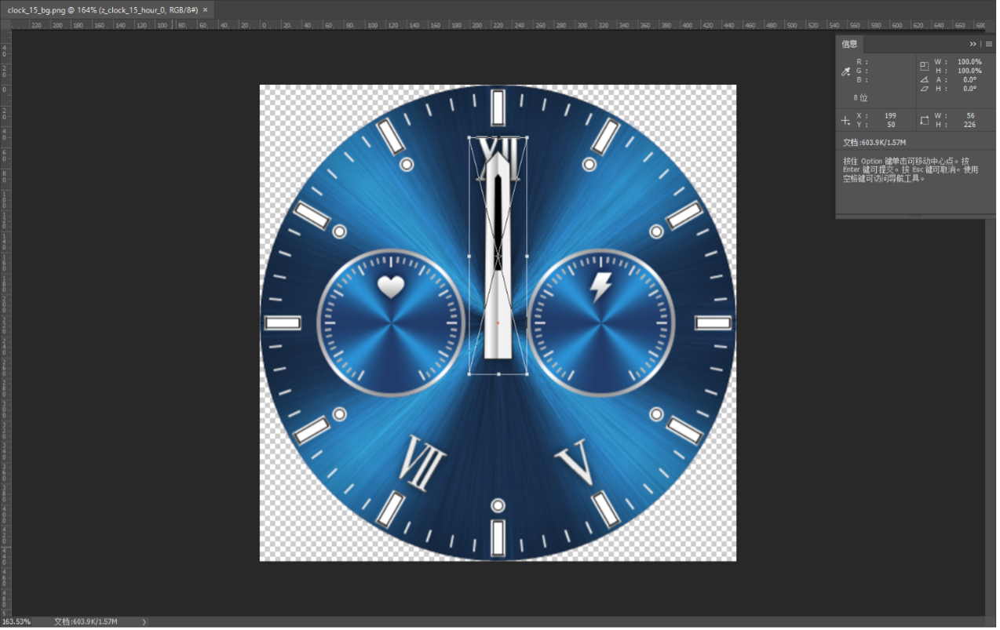

# Custom dial generation rules

Require:
1. dial directory name format: Clockxxxxx, xxxxx indicates the dial ID, 50000 <= ID <= 65535
2. The picture format must be PNG, resolution no more than 466 × 466, size no more than 500KB
3. There must be a picture with the name 'thumbnail', resolution: 300 × 300
4. config.json configuration file. JSON format must be correct to load! Pay attention to the comma / quotation mark problem. After writing, verify it with JSON tool
5. The generated dial file name cannot be changed
6. Place the dial file "Clockxxxx_res" generated under "out" in the “custom” directory of the U disk

Required file:
1. one PNG picture, name containing 'thumbnail', size 300 × 300
2. config.json The configuration file. JSON format must be correct to load! Pay attention to the comma / quotation mark problem. After writing, verify it with JSON tool


## Property setting example:

```
{
    "name": "1. background ",    value: arbitrary string
    "drawType": 0,               value: Refer to the following table [drawType]
    "dataType": 0,               value: Refer to the following table [dataType]
    "alignType": 0,              value: Refer to the following table [alignType]
    "x": 0,                      Coordinate x, value: any number
    "y": 0,                      Coordinate y, value: any number
    "num": 1,                    Value: “imgArr” Length
    "imgArr": [                  Array. 3 cases, reference rules and examples
        1: Pure string
            "custom_clock_bg_0.png",
            "custom_clock_bg_1.png",
            "custom_clock_bg_2.png",
        2: Digital + string
            4,
            100,
            "custom_clock_bg_0.png",
            "custom_clock_bg_1.png",
            "custom_clock_bg_2.png",
        3: Array
            [11, 148, "custom_clock_1_hour_1.png"],
            [12, 148, "custom_clock_1_hour_2.png"],
            [13, 148, "custom_clock_1_hour_3.png"],
    ]
}
```

## Property description:

### drawType

| Val | Description |
|--|--|
| 0 | Draw a normal picture |
| 1 | xx Pure number |
| 2 | xx’ Digital + unit |
| 3 | xx-xx Digital + separator |
| 4 | xx’-xx’ Digital + unit + separator |
| 5 | x.xx xx.x xxx Digital + decimal point |
| 6 | xx% Digital + % |
| | |
| 10 | Fixed point rotation, Second hand |
| 12 | Draw 1-4 picture, A set of pictures of the center rotation, a set of pictures of start angle - start angle+90, width==high |
| 13 | Center rotation, start position one picture, width==high |
| | |
| 20 | Draw a picture, from a set of pictures |
| 21 | Detained point rotation, hour or minute |
| 22 | Draw a picture, a set of pictures of start angle - start angle+90, width==high |
| | |
| 32 | progress |
| | |
| 40 | Level direction list |
| | |
| 61 | xx Pure number vertical |
| 65 | x.xx xx.x xxx Digital + decimal point vertical |


### dataType

| Val | Description |
|--|--|
| 0 | no data |
| **Time data** | |
| 10 | 24-hour needle |
| 11 | Hour |
| 12 | Minute |
| 13 | Second |
| 14 | hour:minute |
| 15 | 0:24;1:am;2:pm |
| 16 | hour:minute:second |
| 17 | Time colon |
| **Date data** | |
| 20 | Year |
| 21 | Month |
| 22 | Day |
| 23 | Week |
| 24 | year-month-day 2021-01-01 |
| 25 | Month-day |
| 26 | year-month-day 21-01-01 |
| 27 | year 2 digits |
| **Weather data** | |
| 30 | Weather type |
| 31 | lowest temperature |
| 32 | Maximum temperature |
| 33 | humidity |
| 35 | temperature range |
| **Sports data** | |
| 40 | Step count |
| 41 | Heart rate |
| 42 | Calories |
| 43 | distance |
| 44 | Step count (5 digits) |
| 45 | Heart rate (3 digits) |
| **Other data** | |
| 50 | Electric value |
| 51 | Power level |
| 52 | Animation |
| **Sleep data** | |
| 91 | Sleep data hour |
| 92 | Sleep data minute |

### alignType

| Val | Description |
|--|--|
| 0 | Left align (top-left) |
| 1 | Center |
| 2 | Right align (top-right) |
| 3 | Top align (top-left) |
| 4 | vertical center |
| 5 | Bottom align (bottom-left) |

## Rule instructions and examples:

### 1. `[drawType == 0]` Draw a normal picture

&emsp;&emsp;`[dataType == 0, 17]`  
&emsp;&emsp;`[alignType == 0, 1, 2]`

```
{
    "name": "1. background ",
    "drawType": 0,
    "dataType": 0,
    "alignType": 0,
    "x": 0,
    "y": 0,
    "num": 1,
    "imgArr": [
        "clock_48_bg.png"
    ]
},
{
    "name": "3. Time colon flashes ",
    "drawType": 0,
    "dataType": 17,
    "alignType": 0,
    "x": 210,
    "y": 340,
    "num": 1,
    "imgArr": [
        "clock_40_time_num_colon.png"
    ]
},
```

### 2. `[drawType == 1]` xx Pure number

&emsp;&emsp;`[dataType == 11, 12, 13, 20, 21, 22, 27, 40, 41, 42, 43, 44, 45, 50]`  
&emsp;&emsp;`[num == 10, 11]` 1-10 indicates that numbers 0-9 11 indicate no data (can be omitted)  
&emsp;&emsp;`[alignType == 0, 1, 2]`

```
{
    "name": "3. time mm",
    "drawType": 1,
    "dataType": 12,
    "alignType": 0,
    "x": 170,
    "y": 231,
    "num": 10,
    "imgArr": [
        "clock_43_minute_num_0.png",
        "clock_43_minute_num_1.png",
        "clock_43_minute_num_2.png",
        "clock_43_minute_num_3.png",
        "clock_43_minute_num_4.png",
        "clock_43_minute_num_5.png",
        "clock_43_minute_num_6.png",
        "clock_43_minute_num_7.png",
        "clock_43_minute_num_8.png",
        "clock_43_minute_num_9.png"
    ]
},
{
    "name": "13. Heart rate data--",
    "drawType": 1,
    "dataType": 41,
    "alignType": 1,
    "x": 340,
    "y": 316,
    "num": 11,
    "imgArr": [
        "clock_41_hr_num_0.png",
        "clock_41_hr_num_1.png",
        "clock_41_hr_num_2.png",
        "clock_41_hr_num_3.png",
        "clock_41_hr_num_4.png",
        "clock_41_hr_num_5.png",
        "clock_41_hr_num_6.png",
        "clock_41_hr_num_7.png",
        "clock_41_hr_num_8.png",
        "clock_41_hr_num_9.png",
        "clock_41_hr_num_dash.png"
    ]
},
```

### 3. `[drawType == 2]` xx' Digital + unit

&emsp;&emsp;`[alignType == 0, 1, 2]`

#### &emsp;&emsp;3.1 `[dataType == 50, 91, 92]`

&emsp;&emsp;&emsp;&emsp;`[num == 11]` 1-10 indicates that numbers 0-9, 11 indicate the unit

#### &emsp;&emsp;3.2 `[dataType == 41]`

&emsp;&emsp;&emsp;&emsp;`[num == 12]` 1-10 indicates that numbers 0-9, 11 indicate the unit, 12 indicate no data

#### &emsp;&emsp;3.3 `[dataType == 31, 32]`

&emsp;&emsp;&emsp;&emsp;`[num == 13]` 1-10 indicates that numbers 0-9, 11 indicate the unit, 12 indicates the negative, 13 indicates no data

```
{
    "name": "3. The highest temperature ",
    "drawType": 2,
    "dataType": 32,
    "alignType": 0,
    "x": 226,
    "y": 49,
    "num": 13,
    "imgArr": [
        "clock_48_weather_num_0.png",
        "clock_48_weather_num_1.png",
        "clock_48_weather_num_2.png",
        "clock_48_weather_num_3.png",
        "clock_48_weather_num_4.png",
        "clock_48_weather_num_5.png",
        "clock_48_weather_num_6.png",
        "clock_48_weather_num_7.png",
        "clock_48_weather_num_8.png",
        "clock_48_weather_num_9.png",
        "clock_48_weather_num_degree.png",
        "clock_48_weather_num_minus.png",
        "clock_48_weather_num_dash.png"
    ]
},
```

### 4. `[drawType == 3]` xx-xx Digital + separator

&emsp;&emsp;`[dataType == 14, 16, 24, 25, 26]`  
&emsp;&emsp;`[num == 11]` 1-10 indicates that numbers 0-9, 11 indicates separator  
&emsp;&emsp;`[alignType == 0, 1, 2]`

```
{
    "name": "2. time h:m",
    "drawType": 3,
    "dataType": 14,
    "alignType": 0,
    "x": 156,
    "y": 68,
    "num": 11,
    "imgArr": [
        "clock_20_time_num_0.png",
        "clock_20_time_num_1.png",
        "clock_20_time_num_2.png",
        "clock_20_time_num_3.png",
        "clock_20_time_num_4.png",
        "clock_20_time_num_5.png",
        "clock_20_time_num_6.png",
        "clock_20_time_num_7.png",
        "clock_20_time_num_8.png",
        "clock_20_time_num_9.png",
        "clock_20_time_num_colon.png"
    ]
},
{
    "name": "9. date MM-DD",
    "drawType": 3,
    "dataType": 25,
    "alignType": 0,
    "x": 133,
    "y": 212,
    "num": 11,
    "imgArr": [
        "clock_48_date_num_0.png",
        "clock_48_date_num_1.png",
        "clock_48_date_num_2.png",
        "clock_48_date_num_3.png",
        "clock_48_date_num_4.png",
        "clock_48_date_num_5.png",
        "clock_48_date_num_6.png",
        "clock_48_date_num_7.png",
        "clock_48_date_num_8.png",
        "clock_48_date_num_9.png",
        "clock_48_date_num_dash.png"
    ]
},
```

### 5. `[drawType == 4]` xx'-xx' Digital + unit + separator

&emsp;&emsp;`[dataType == 35]`  
&emsp;&emsp;`[num == 14]` 1-10 indicates that numbers 0-9, 11 indicate the unit, 12 indicates separator, 13 indicates the negative, 14 indicates no data  
&emsp;&emsp;`[alignType == 0, 1, 2]`

```
{
    "name": "14. Weather temperature range ",
    "drawType": 4,
    "dataType": 35,
    "alignType": 1,
    "x": 226,
    "y": 402,
    "num": 14,
    "imgArr": [
        "clock_48_weather_num_0.png",
        "clock_48_weather_num_1.png",
        "clock_48_weather_num_2.png",
        "clock_48_weather_num_3.png",
        "clock_48_weather_num_4.png",
        "clock_48_weather_num_5.png",
        "clock_48_weather_num_6.png",
        "clock_48_weather_num_7.png",
        "clock_48_weather_num_8.png",
        "clock_48_weather_num_9.png",
        "clock_48_weather_num_degree.png",
        "clock_48_weather_num_sep.png",
        "clock_48_weather_num_minus.png",
        "clock_48_weather_num_dash.png"
    ]
},
```

### 6. `[drawType == 5]` x.xx xx.x xxx Digital + decimal point

&emsp;&emsp;`[dataType == 42, 43]`  
&emsp;&emsp;`[num == 11]` 1-10 indicates the number 0-9, and 11 indicates the decimal point  
&emsp;&emsp;`[alignType == 0, 1, 2]`

```
{
    "name": "11. Calorie data ",
    "drawType": 5,
    "dataType": 42,
    "alignType": 0,
    "x": 176,
    "y": 338,
    "num": 11,
    "imgArr": [
        "clock_48_kcal_num_0.png",
        "clock_48_kcal_num_1.png",
        "clock_48_kcal_num_2.png",
        "clock_48_kcal_num_3.png",
        "clock_48_kcal_num_4.png",
        "clock_48_kcal_num_5.png",
        "clock_48_kcal_num_6.png",
        "clock_48_kcal_num_7.png",
        "clock_48_kcal_num_8.png",
        "clock_48_kcal_num_9.png",
        "clock_48_kcal_num_dot.png"
    ]
},
```

### 7. `[drawType == 6]` xx% Digital + %

&emsp;&emsp;`[dataType == 33, 40, 42, 43, 50]`  
&emsp;&emsp;`[num == 11]` 1-10 indicates that numbers 0-9, 11 indicates %  
&emsp;&emsp;`[alignType == 0, 1, 2]`

```
{
    "name": "6. Electrical value %",
    "drawType": 6,
    "dataType": 50,
    "alignType": 1,
    "x": 226,
    "y": 152,
    "num": 11,
    "imgArr": [
        "clock_48_bat_num_0.png",
        "clock_48_bat_num_1.png",
        "clock_48_bat_num_2.png",
        "clock_48_bat_num_3.png",
        "clock_48_bat_num_4.png",
        "clock_48_bat_num_5.png",
        "clock_48_bat_num_6.png",
        "clock_48_bat_num_7.png",
        "clock_48_bat_num_8.png",
        "clock_48_bat_num_9.png",
        "clock_48_bat_num_percent.png"
    ]
},
```

### 8. `[drawType == 10]` Ding point rotation, second hand

&emsp;&emsp;`[dataType == 13]`  
&emsp;&emsp;`[num == 15]`  
&emsp;&emsp;`[x, y == 0]`  
&emsp;&emsp;`[imgArr]  [1, 2, 3]` 1,2 indicate the rotation point coordinate, 3 indicate the picture name  
&emsp;&emsp;`[alignType == 0, 1, 2]`

```
{
    "name": "11. Second hand ",
    "drawType": 10,
    "dataType": 13,
    "alignType": 0,
    "x": 0,
    "y": 0,
    "num": 15,
    "imgArr": [
        [9, 198, "clock_48_second_00.png"],
        [10, 198, "clock_48_second_01.png"],
        [11, 195, "clock_48_second_02.png"],
        [15, 189, "clock_48_second_03.png"],
        [18, 182, "clock_48_second_04.png"],
        [22, 173, "clock_48_second_05.png"],
        [25, 162, "clock_48_second_06.png"],
        [28, 149, "clock_48_second_07.png"],
        [30, 135, "clock_48_second_08.png"],
        [33, 118, "clock_48_second_09.png"],
        [35, 101, "clock_48_second_10.png"],
        [36, 83, "clock_48_second_11.png"],
        [37, 64, "clock_48_second_12.png"],
        [38, 44, "clock_48_second_13.png"],
        [39, 23, "clock_48_second_14.png"]
    ]
},
```

#### &emsp;&emsp;Dial pointer coordinate positioning method:

&emsp;&emsp;Use Photoshop to move the pointer picture to the appropriate position of the background picture (466 × 466), and mark the midpoint of the background picture, that is, the rotation point of the pointer picture Measure the top- left (0,0) coordinate of the point relative to the pointer picture



### 9. `[drawType == 12]` Draw 1-4 picture, A set of pictures of the center rotation, a set of pictures of start angle - start angle+90, width==high

&emsp;&emsp;`[dataType == 42, 50]`  
&emsp;&emsp;`[alignType]`: value = (Angle from start to end)/90°×"num"

```
{
    "name": "11. Electricity cursor ",
    "drawType": 12,
    "dataType": 50,
    "alignType": 24,
    "x": 286,
    "y": 284,
    "num": 6,
    "imgArr": [
        "clock_4356_small_cursor_0.png",
        "clock_4356_small_cursor_1.png",
        "clock_4356_small_cursor_2.png",
        "clock_4356_small_cursor_3.png",
        "clock_4356_small_cursor_4.png",
        "clock_4356_small_cursor_5.png"
    ]
},
```

### 10. `[drawType == 13]` Center rotation, start position one picture, width==high

&emsp;&emsp;`[dataType == 21, 22]`  
&emsp;&emsp;`[num == 1]`  
&emsp;&emsp;`[alignType]`: Degree of rotation 1 time

```
{
    "name": "8. month",
    "drawType": 13,
    "dataType": 21,
    "alignType": 30,
    "x": 43,
    "y": 153,
    "num": 1,
    "imgArr": [
        "clock_4354_date_pointer.png"
    ]
},
```

### 11. `[drawType == 20]` Draw a picture, from a set of pictures

&emsp;&emsp;`[alignType == 0, 1, 2]`

#### &emsp;&emsp;11.1 `[dataType == 21, 23, 30, 40, 41, 42, 50]`

```
{
    "name": "2. Step background ",
    "drawType": 20,
    "dataType": 40,
    "alignType": 0,
    "x": 58,
    "y": 72,
    "num": 6,
    "imgArr": [
        "z_clock_48_step_bg_0.png",
        "z_clock_48_step_bg_1.png",
        "z_clock_48_step_bg_2.png",
        "z_clock_48_step_bg_3.png",
        "z_clock_48_step_bg_4.png",
        "z_clock_48_step_bg_5.png"
    ]
},
```

#### &emsp;&emsp;11.2 `[dataType == 15]`

&emsp;&emsp;&emsp;&emsp;`[num == 3]` 1 indicates 24 hours, 2 indicates AM, 3 means PM  
&emsp;&emsp;&emsp;&emsp;`[imgArr]`: 1 == 2 indicates that the picture is not displayed in 24 hours

```
{
    "name": "6. Hour system ",
    "drawType": 20,
    "dataType": 15,
    "alignType": 0,
    "x": 320,
    "y": 96,
    "num": 3,
    "imgArr": [
        "z_clock_41_time24_am.png",
        "z_clock_41_time24_am.png",
        "z_clock_41_time24_pm.png"
    ]
},
```

#### &emsp;&emsp;11.3 `[dataType == 52]`

&emsp;&emsp;&emsp;&emsp;`[interval >= 250]` The 'interval' property must be set

```
{
    "name": "14. animation ",
    "drawType": 20,
    "dataType": 52,
    "alignType": 0,
    "interval": 250,
    "x": 137,
    "y": 7,
    "num": 23,
    "imgArr": [
        "z_clock_4615_animal_00.png",
        "z_clock_4615_animal_01.png",
        "z_clock_4615_animal_02.png",
        "z_clock_4615_animal_03.png",
        "z_clock_4615_animal_04.png",
        "z_clock_4615_animal_05.png",
        "z_clock_4615_animal_06.png",
        "z_clock_4615_animal_07.png",
        "z_clock_4615_animal_08.png",
        "z_clock_4615_animal_09.png",
        "z_clock_4615_animal_10.png",
        "z_clock_4615_animal_11.png",
        "z_clock_4615_animal_12.png",
        "z_clock_4615_animal_13.png",
        "z_clock_4615_animal_14.png",
        "z_clock_4615_animal_15.png",
        "z_clock_4615_animal_16.png",
        "z_clock_4615_animal_17.png",
        "z_clock_4615_animal_18.png",
        "z_clock_4615_animal_19.png",
        "z_clock_4615_animal_20.png",
        "z_clock_4615_animal_21.png",
        "z_clock_4615_animal_22.png"
    ]
},
```

### 12. `[drawType == 21]` Detained point rotation, hour or minute

&emsp;&emsp;`[dataType == 10, 11, 12]`  
&emsp;&emsp;`[num == 15, 18]` 15 pictures (dataType == 10, 18)  
&emsp;&emsp;`[x, y == 0]`  
&emsp;&emsp;`[imgArr] [1, 2, 3]` 1,2 indicate the rotation point coordinate, 3 indicate picture name starting with 'z_'  
&emsp;&emsp;`[alignType == 0, 1, 2]`

```
{
    "name": "6. 24-hour half ",
    "drawType": 21,
    "dataType": 10,
    "alignType": 0,
    "x": 0,
    "y": 0,
    "num": 18,
    "imgArr": [
        [20, 203, "z_clock_4355_hour_24_0.png"],
        [21, 203, "z_clock_4355_hour_24_1.png"],
        [21, 201, "z_clock_4355_hour_24_2.png"],
        [21, 198, "z_clock_4355_hour_24_3.png"],
        [21, 194, "z_clock_4355_hour_24_4.png"],
        [21, 187, "z_clock_4355_hour_24_5.png"],
        [21, 179, "z_clock_4355_hour_24_6.png"],
        [21, 171, "z_clock_4355_hour_24_7.png"],
        [21, 161, "z_clock_4355_hour_24_8.png"],
        [20, 149, "z_clock_4355_hour_24_9.png"],
        [21, 136, "z_clock_4355_hour_24_10.png"],
        [21, 123, "z_clock_4355_hour_24_11.png"],
        [21, 108, "z_clock_4355_hour_24_12.png"],
        [21, 92, "z_clock_4355_hour_24_13.png"],
        [21, 76, "z_clock_4355_hour_24_14.png"],
        [21, 60, "z_clock_4355_hour_24_15.png"],
        [21, 42, "z_clock_4355_hour_24_16.png"],
        [21, 25, "z_clock_4355_hour_24_17.png"]
    ]
},
{
    "name": "10. minute hand ",
    "drawType": 21,
    "dataType": 12,
    "alignType": 0,
    "x": 0,
    "y": 0,
    "num": 15,
    "imgArr": [
        [25, 208, "z_clock_48_minute_00.png"],
        [28, 207, "z_clock_48_minute_01.png"],
        [31, 204, "z_clock_48_minute_02.png"],
        [34, 199, "z_clock_48_minute_03.png"],
        [36, 192, "z_clock_48_minute_04.png"],
        [39, 183, "z_clock_48_minute_05.png"],
        [41, 172, "z_clock_48_minute_06.png"],
        [43, 153, "z_clock_48_minute_07.png"],
        [44, 146, "z_clock_48_minute_08.png"],
        [46, 131, "z_clock_48_minute_09.png"],
        [47, 114, "z_clock_48_minute_10.png"],
        [48, 97, "z_clock_48_minute_11.png"],
        [48, 79, "z_clock_48_minute_12.png"],
        [48, 61, "z_clock_48_minute_13.png"],
        [48, 42, "z_clock_48_minute_14.png"]
    ]
},
```

### 13. `[drawType == 22]` Draw a picture, a set of pictures of start angle - start angle+90, width==high

&emsp;&emsp;`[dataType == 41, 42, 50]`  
&emsp;&emsp;`[alignType]`: value = (Angle from start to end)/90°×"num"

```
{
    "name": "2. Electricity pointer center rotation ",
    "drawType": 22,
    "dataType": 50,
    "alignType": 21,
    "x": 172,
    "y": 172,
    "num": 7,
    "imgArr": [
        "z_clock_78_bat_pointer_0.png",
        "z_clock_78_bat_pointer_1.png",
        "z_clock_78_bat_pointer_2.png",
        "z_clock_78_bat_pointer_3.png",
        "z_clock_78_bat_pointer_4.png",
        "z_clock_78_bat_pointer_5.png",
        "z_clock_78_bat_pointer_6.png"
    ]
},
```

### 14. [drawType == 32] progress rate

&emsp;&emsp;`[dataType == 40, 41, 42, 43, 50]`  
&emsp;&emsp;`[alignType == 0, 1, 2, 3]`:  
&emsp;&emsp;&emsp;&emsp;0: top → bottom  
&emsp;&emsp;&emsp;&emsp;1: bottom → top  
&emsp;&emsp;&emsp;&emsp;2: left → right  
&emsp;&emsp;&emsp;&emsp;3: right → left  
&emsp;&emsp;`[num == 7]`  
&emsp;&emsp;`[imgArr]`:  
&emsp;&emsp;&emsp;&emsp;0: Total lattice number  
&emsp;&emsp;&emsp;&emsp;1: Grid width  
&emsp;&emsp;&emsp;&emsp;2: Two grid gap  
&emsp;&emsp;&emsp;&emsp;3: Minimum value  
&emsp;&emsp;&emsp;&emsp;4: Maximum value  
&emsp;&emsp;&emsp;&emsp;5: Cover sign position, 1:cover  
&emsp;&emsp;&emsp;&emsp;6: Picture name

```
{
    "name": "1. Progress heart rate ",
    "drawType": 32,
    "dataType": 41,
    "alignType": 2,
    "x": 270,
    "y": 214,
    "num": 7,
    "imgArr": [
        1,
        180,
        0,
        0,
        200,
        0,
        "clock_72_hr_bar.png"
    ]
},
{
    "name": "0. Progress steps cover ",
    "drawType": 32,
    "dataType": 40,
    "alignType": 3,
    "x": 318,
    "y": 240,
    "num": 7,
    "imgArr": [
        10,
        16,
        8,
        0,
        10000,
        1,
        "clock_63_step_bar.png"
    ]
},
{
    "name": "2. Progress energy ",
    "drawType": 32,
    "dataType": 50,
    "alignType": 2,
    "x": 57,
    "y": 176,
    "num": 7,
    "imgArr": [
        10,
        14,
        4,
        0,
        100,
        0,
        "clock_92_bat_bar.png"
    ]
},
```

### 15. `[drawType == 40]` Horizontal direction list

&emsp;&emsp;`[alignType == 0, 1, 2]`

#### &emsp;&emsp;15.1 `[dataType == 23]`

&emsp;&emsp;`[num == 10]`:  
&emsp;&emsp;`[imgArr]`:  
&emsp;&emsp;&emsp;&emsp;1: Number of lists  
&emsp;&emsp;&emsp;&emsp;2: List item width  
&emsp;&emsp;&emsp;&emsp;3-9: Sunday - Saturday Picture  
&emsp;&emsp;&emsp;&emsp;10: Today picture

```
{
    "name": "7. Week list ",
    "drawType": 40,
    "dataType": 23,
    "alignType": 0,
    "x": 42,
    "y": 185,
    "num": 10,
    "imgArr": [
        4,
        100,
        "clock_35_week_sun.png",
        "clock_35_week_mon.png",
        "clock_35_week_tue.png",
        "clock_35_week_wed.png",
        "clock_35_week_thu.png",
        "clock_35_week_fri.png",
        "clock_35_week_sat.png",
        "clock_35_week_now.png"
    ]
},
```

#### &emsp;&emsp;15.2 `[dataType == 30]`

&emsp;&emsp;`[num == 9]`:  
&emsp;&emsp;`[imgArr]`:  
&emsp;&emsp;&emsp;&emsp;1: Number of lists  
&emsp;&emsp;&emsp;&emsp;2: List item width  
&emsp;&emsp;&emsp;&emsp;3-9: Weather type picture order: unknow-sunny-cloudy-rain-snow-smog-thunder

```
{
    "name": "8. Weather icon list ",
    "drawType": 40,
    "dataType": 30,
    "alignType": 0,
    "x": 45,
    "y": 216,
    "num": 9,
    "imgArr": [
        4,
        100,
        "clock_35_weather_type_unknow.png",
        "clock_35_weather_type_sunny.png",
        "clock_35_weather_type_cloudy.png",
        "clock_35_weather_type_rain.png",
        "clock_35_weather_type_snow.png",
        "clock_35_weather_type_smog.png",
        "clock_35_weather_type_thunder.png"
    ]
},
```

#### &emsp;&emsp;15.3 `[dataType == 31, 32, 35]`

&emsp;&emsp;`[num == 15]`:  
&emsp;&emsp;`[imgArr]`:  
&emsp;&emsp;&emsp;&emsp;1: Number of lists  
&emsp;&emsp;&emsp;&emsp;2: List item width  
&emsp;&emsp;&emsp;&emsp;3-12: Number 0-9  
&emsp;&emsp;&emsp;&emsp;13: unit  
&emsp;&emsp;&emsp;&emsp;14: negative  
&emsp;&emsp;&emsp;&emsp;15: no data

```
{
    "name": "9. Weather maximum temperature list ",
    "drawType": 40,
    "dataType": 32,
    "alignType": 1,
    "x": 76,
    "y": 297,
    "num": 15,
    "imgArr": [
        4,
        100,
        "clock_35_weather_num_0.png",
        "clock_35_weather_num_1.png",
        "clock_35_weather_num_2.png",
        "clock_35_weather_num_3.png",
        "clock_35_weather_num_4.png",
        "clock_35_weather_num_5.png",
        "clock_35_weather_num_6.png",
        "clock_35_weather_num_7.png",
        "clock_35_weather_num_8.png",
        "clock_35_weather_num_9.png",
        "clock_35_weather_num_degree.png",
        "clock_35_weather_num_minus.png",
        "clock_35_weather_num_dash.png"
    ]
},
```

### 16. `[drawType == 55]` Shortut to screen

&emsp;&emsp;`[dataType == 0]`  
&emsp;&emsp;`[alignType == 0, 1]`  
&emsp;&emsp;`[num == 4]`:  
&emsp;&emsp;`[imgArr]`:  
&emsp;&emsp;&emsp;&emsp;1: Shortcut picture width  
&emsp;&emsp;&emsp;&emsp;2: Shortcut picture height  
&emsp;&emsp;&emsp;&emsp;3: Screen name. Tested values:  
&emsp;&emsp;&emsp;&emsp;&emsp;&emsp;• `CalendarScreen`  
&emsp;&emsp;&emsp;&emsp;&emsp;&emsp;• `HistoryDataScreen`  
&emsp;&emsp;&emsp;&emsp;&emsp;&emsp;• `TimerScreen`  
&emsp;&emsp;&emsp;&emsp;&emsp;&emsp;• `DialpadScreen`  
&emsp;&emsp;&emsp;&emsp;&emsp;&emsp;• `CameraScreen`  
&emsp;&emsp;&emsp;&emsp;&emsp;&emsp;• `NotificationScreen`  
&emsp;&emsp;&emsp;&emsp;&emsp;&emsp;• `StopWatchScreen`  
&emsp;&emsp;&emsp;&emsp;&emsp;&emsp;• `AlarmNewScreen`  
&emsp;&emsp;&emsp;&emsp;&emsp;&emsp;• `WeatherScreen`  
&emsp;&emsp;&emsp;&emsp;&emsp;&emsp;• `ContactScreen`  
&emsp;&emsp;&emsp;&emsp;&emsp;&emsp;• `MusicPlayScreen`  
&emsp;&emsp;&emsp;&emsp;&emsp;&emsp;• `SleepDetailScreen`  
&emsp;&emsp;&emsp;&emsp;&emsp;&emsp;• `RecordScreen`  
&emsp;&emsp;&emsp;&emsp;&emsp;&emsp;• `HRScreen`  
&emsp;&emsp;&emsp;&emsp;4: Shortcut picture

```
{
    "drawType": 55,
    "dataType": 0,
    "alignType": 1,
    "x": 338,
    "y": 376,
    "num": 4,
    "imgArr": [
        43,
        51,
        "CalendarScreen",
        "a_cal.png"
    ]
},
```

### 17. `[drawType == 61]` xx Pure digital vertical

&emsp;&emsp;`[dataType == 11, 12, 13, 20, 21, 22, 27, 40, 41, 42, 43, 44, 45, 50]`  
&emsp;&emsp;`[num == 10, 11]` 1-10 indicates numbers 0-9, 11 indicates no data (can be omitted)  
&emsp;&emsp;`[alignType == 3, 4, 5]`

```
{
    "name": "8. Step data vertical ",
    "drawType": 61,
    "dataType": 40,
    "alignType": 3,
    "x": 110,
    "y": 64,
    "num": 10,
    "imgArr": [
        "clock_4613_num_0.png",
        "clock_4613_num_1.png",
        "clock_4613_num_2.png",
        "clock_4613_num_3.png",
        "clock_4613_num_4.png",
        "clock_4613_num_5.png",
        "clock_4613_num_6.png",
        "clock_4613_num_7.png",
        "clock_4613_num_8.png",
        "clock_4613_num_9.png"
    ]
},
```

### 18. `[drawType == 65]` x.xx xx.x xxx Digital + decimal point vertical

&emsp;&emsp;`[dataType == 42, 43]`  
&emsp;&emsp;`[num == 11]` 1-10 indicates the number 0-9, 11 indicates the decimal point  
&emsp;&emsp;`[alignType == 3, 4, 5]`

```
{
    "name": "9. Calorie data vertical ",
    "drawType": 65,
    "dataType": 42,
    "alignType": 3,
    "x": 142,
    "y": 64,
    "num": 11,
    "imgArr": [
        "clock_4613_num_0.png",
        "clock_4613_num_1.png",
        "clock_4613_num_2.png",
        "clock_4613_num_3.png",
        "clock_4613_num_4.png",
        "clock_4613_num_5.png",
        "clock_4613_num_6.png",
        "clock_4613_num_7.png",
        "clock_4613_num_8.png",
        "clock_4613_num_9.png",
        "clock_4613_num_dot.png"
    ]
},
```
